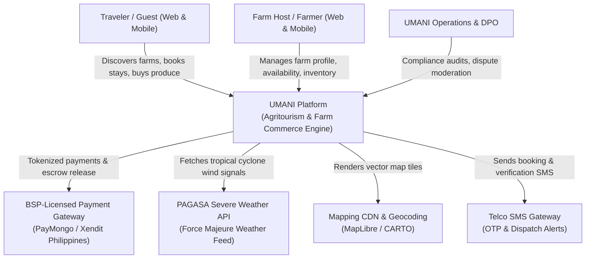
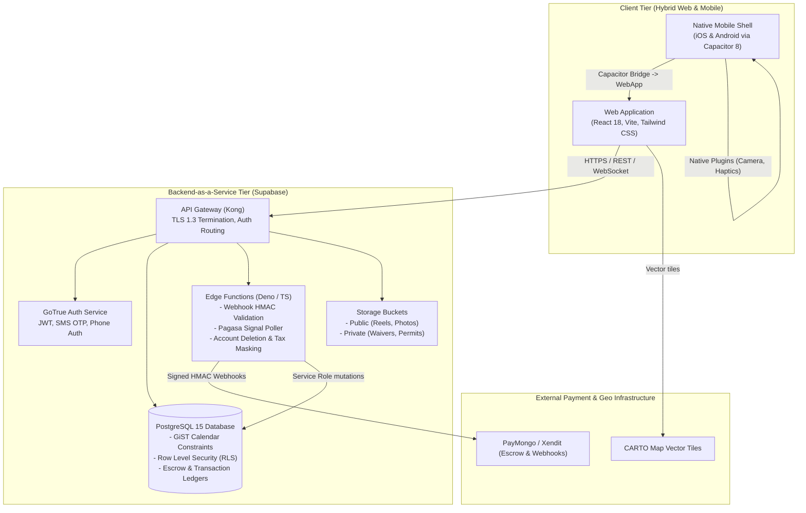
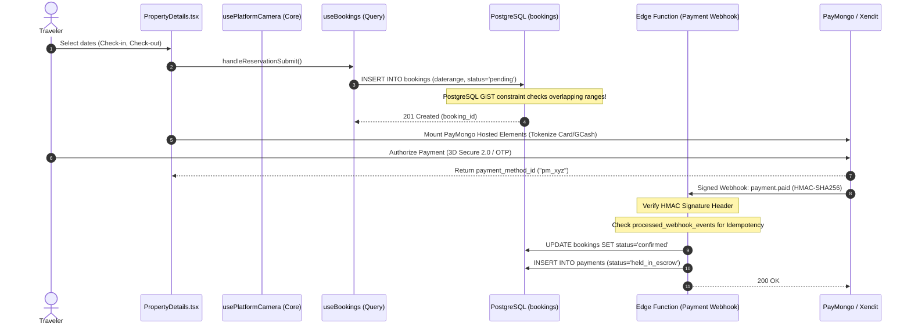

# The C4 Model & Mermaid Architecture Diagrams

The **C4 Model** (created by Simon Brown) is an industry-standard, lightweight hierarchical framework for describing software architecture at different levels of abstraction: **Context**, **Containers**, **Components**, and **Code**.

---

## 1. Level 1: System Context Diagram

The System Context diagram is a bird's-eye view showing how the software system fits into the broader world, including users and external systems.

### UMANI System Context (Mermaid)

---

## 2. Level 2: Container Diagram

A Container diagram zooms into the software system, showing the high-level technical building blocks (web frontend, mobile container, serverless functions, database) and how they communicate.

### UMANI Containers (Mermaid)

---

## 3. Level 3: Component Diagram (Farm Booking & Escrow Flow)

Component diagrams zoom into an individual container (e.g. Booking Engine & Database) to illustrate internal feature modules, controllers, repositories, and state machines.

---

## 4. Level 4: Code Diagram (UML / Interface Structure)

Optional level representing fine-grained class structures, adapter interfaces, and entity relationships. In UMANI, code diagrams are typically used to document Platform Adapter Facades (`core/platform`) and TanStack Query key factories.
