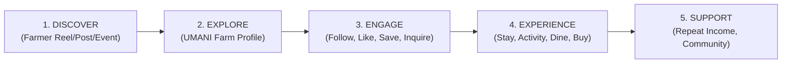

# UMANI: Product Vision & Strategic Architecture

> **Brand Identity:** **UMANI** (*UMA* + *ANI*)  
> **Tagline:** *"Bring the whole farm online."*  
> **Supporting Tagline:** *"Discover the farm. Follow the story. Experience more."*  
> **Document Status:** Approved Baseline (Rebrand & 6-Pillar Ecosystem)  
> **Source Material:** Official UMANI Rebranding & Product Direction + Landing Page Specifications  
> **Last Updated:** September 2026  

---

## 1. Executive Summary & The UMANI Concept

### 1.1 What UMANI Means
UMANI is inspired by the organic combination of two foundational agricultural concepts:
* **UMA:** Farm / farmland / agricultural space.
* **ANI:** Harvest / what the farm produces.

Together, **UMANI** supports the idea of the farm and everything that comes from it: its produce, experiences, stories, culinary traditions, people, and economic opportunities.

### 1.2 The Core Thesis
> **"UMANI brings the whole farm online."**  
> *From a farm-stay concept to a farmer-centered agritourism ecosystem.*

### 1.3 The Strategic Shift
The previous identity (AgriBnV) was built around the narrow concept of "agriculture, bed, and venture." As the product evolved, this identity became too restrictive. UMANI reflects our comprehensive direction: **a farmer-centered digital platform where a farm can showcase its full identity, offerings, stories, activities, products, and dining—not only its accommodation.**

| Dimension | Legacy Direction (AgriBnV) | New Direction (UMANI) |
| :--- | :--- | :--- |
| **Core Focus** | Farm-stay / booking focused | Whole-farm digital presence |
| **User Motivation** | Tourist searches for accommodation | People discover farmers, lands, and harvests |
| **Mechanic** | Transaction-centered | Discovery + Engagement + Transactions |
| **Main Offering** | Accommodation as the sole main asset | Stays + Experiences + Events + Products + Kitchen + Content |
| **Perception** | Farm as a temporary travel destination | Farm as a living story and living ecosystem |

### 1.4 Product Positioning
> **A farmer-centered agritourism platform that connects people to farms through discovery, experiences, content, and commerce.**

---

## 2. The Six Pillars of the UMANI Farm Ecosystem

In UMANI, every farm on the platform possesses a unified digital ecosystem structured across 6 core pillars:

```
┌────────────────────────────────────────────────────────────────────────────────────────────────────────┐
│                                       UMANI FARM ECOSYSTEM                                             │
├───────────────────┬───────────────────┬───────────────────┬──────────────────┬────────────────┬────────┤
│  1. FARM PROFILE  │   2. FARM STAY    │ 3. EXPERIENCES    │ 4. EVENTS &      │ 5. PRODUCTS    │6. FARM │
│   (Digital Home)  │   (Hospitality)   │ (Hands-on Action) │    SCHEDULE      │  (Commerce)    │KITCHEN │
├───────────────────┼───────────────────┼───────────────────┼──────────────────┼────────────────┼────────┤
│ • Farm story      │ • Kubo huts       │ • Harvesting runs │ • Seasonal event │ • Fresh crops  │• Farm- │
│ • Farmer bio/why  │ • Eco-cottages    │ • Tree planting   │ • Workshops      │ • Raw honey    │  table │
│ • Terroir & map   │ • Glamping / camp │ • Guided tours    │ • Harvest period │ • Roasted beans│  meals │
│ • Crops & animals │ • Live calendar   │ • Animal sessions │ • Cohort visits  │ • Seedlings &  │• Local │
│ • Certifications  │ • GiST locking    │ • Masterclasses   │ • Ticket booking │   tablea goods │  menus │
│ • Facilities      │ • Transparent fees│ • Day passes      │ • RSVP system    │ • 24h disputes │• Order │
└───────────────────┴───────────────────┴───────────────────┴──────────────────┴────────────────┴────────┘
                                    ▲
                                    │ (Drives Discovery & Traffic)
┌───────────────────────────────────┴────────────────────────────────────────────────────────────────────┐
│                             DISCOVERY ENGINE: THE FARM FEED (AgriReels & Posts)                        │
│   • Planting & harvest updates  • Behind-the-scenes farm work  • Animal life  • Educational stories    │
└────────────────────────────────────────────────────────────────────────────────────────────────────────┘
```

### 1. Farm Profile (The Digital Home)
The central anchor for the farmer: farm story, ethos, location/terroir, crops grown, livestock raised, certifications, facilities, photos, and contact information.

### 2. Farm Stay (Accommodations)
Rooms, cottages, kubo huts, glamping, and farm campsites. Complete with nightly rates, real-time calendar availability, transparent price breakdowns, and PostgreSQL atomic GiST double-booking protection.

### 3. Farm Experiences (Hands-On Activities)
Guided farm tours, hands-on agricultural activities (planting, weeding, fruit picking, honey harvesting), animal care sessions, and educational workshops.

### 4. Events & Schedule (Seasonal Calendar)
Upcoming farm events, seasonal activities, workshops, harvest periods, and scheduled group experiences. Allows farms to organize cohort visits and seasonal surges.

### 5. Farm Products (Direct Agricultural Commerce)
Produce, seeds, seedlings, and processed artisanal goods (honey, tablea, coffee beans, virgin coconut oil). Gives farms direct-to-consumer revenue year-round.

### 6. Farm Kitchen (Culinary Experience)
Farm-to-table dining, seasonal food menus, local culinary specialties, and advance food orders for travelers and day visitors.

---

## 3. The Farm Feed: Discovery Through Content

UMANI integrates a short-form content experience inspired by modern social media platforms (9:16 vertical video reels and rich photo journals).

### 3.1 Content Types
* Harvest and planting updates
* Day-to-day farm life & weather
* Animals, livestock, and crops
* Behind-the-scenes agricultural labor
* Farm products, harvest prep, and culinary dishes
* Upcoming events and workshop teasers
* Farmer wisdom, heritage stories, and educational content

### 3.2 Core Discovery Principle
> *"We can't all tell their story, so we made a way for them to tell their own story."*  
>
> **Important Product Principle:**  
> **The Farm Feed is not social media for its own sake.** It is the **discovery engine** that leads people through the conversion funnel:  
> $$\text{Content} \longrightarrow \text{Farmer} \longrightarrow \text{Farm Profile} \longrightarrow \text{Stay / Experience / Product / Kitchen}$$

---

## 4. The New User Journey



1. **DISCOVER:** A person encounters a farmer's short video, post, product, event, or farm pin.
2. **EXPLORE:** They visit the farmer's UMANI profile and see the *whole farm* in one unified space.
3. **ENGAGE:** They follow the farm, interact with posts, bookmark stays, save products, or message the farmer.
4. **EXPERIENCE:** They visit, stay overnight, join a workshop, eat at the farm kitchen, or order fresh harvest products.
5. **SUPPORT:** The farmer gains multiple sustainable income streams and an engaged, long-term digital audience.

---

## 5. Developer Direction & Architecture Principles

### 5.1 Core Domain Objects
The UMANI domain model consists of 11 interconnected entities:
1. **Farmer / Host:** The producer with identity, verification, and bio.
2. **Farm:** The physical land, terroir, coordinates, and facilities.
3. **Farm Profile:** The public digital aggregator uniting all farm assets.
4. **Farm Stay / Accommodation:** Lodging units with calendar availability and pricing.
5. **Experience:** Bookable day activities and tours.
6. **Event / Schedule:** Calendar events, workshops, and harvest cohorts.
7. **Product:** Agricultural produce and artisanal processed goods.
8. **Farm Kitchen / Menu Item:** Farm dining dishes and advance meal bookings.
9. **Post / Video (Reel):** Farmer-generated discovery content.
10. **Follower / User:** Guest account, follow graph, and saved bookmarks.
11. **Inquiry / Order / Reservation:** Transactional records.

### 5.2 The Unified Ecosystem Invariant
> **Key Product Principle:**  
> **All offerings should connect back to one Farm Profile.**  
> A user must never feel like they are switching between disconnected apps or fragmented silos; they should feel that they are exploring **one complete farm ecosystem**.

### 5.3 Suggested Development Priorities

| Priority | Feature Pillar | Strategic Purpose |
| :---: | :--- | :--- |
| **P1** | **Farm Profile** | Foundation of every farmer's digital presence |
| **P2** | **Farm Stay / Experience** | Core agritourism transactions (retaining GiST locking) |
| **P3** | **Events & Schedule** | Makes seasonal farm activities discoverable and organized |
| **P4** | **Products & Farm Kitchen** | Expands farm monetization beyond lodging |
| **P5** | **Farm Feed** | Drives top-of-funnel discovery, virality, and engagement |
| **P6** | **Follow / Save / Share** | Builds long-term audience retention around farmers |

### 5.4 User Roles & Ecosystem Personas

The UMANI platform operates across five key personas:
1. **Farmers / Hosts (`host`):** Agricultural creators and venue hosts who publish Farm Profiles, Stays, Experiences, Events, Products, Kitchen Menus, and AgriReels.
2. **Average Users / Consumers (`guest`):** Travelers, foodies, local buyers, and community members who discover, follow, book stays, attend events, buy goods, dine, and socially interact (like, comment, bookmark, share).
3. **Content Moderators (`moderator`):** Trust & Safety agents who review flagged content, enforce community standards, process DMCA takedowns, and audit farm accreditation claims.
4. **Platform Administrators (`admin`):** Operations leaders who supervise global metrics, arbitrate financial/force-majeure disputes, verify host credentials, and govern system configurations.
5. **Anonymous Visitors (`anon`):** Unauthenticated explorers who can browse public landing pages, explore search grids, and view farm profiles in read-only mode.

---

## 6. Landing Page Architecture & Conversion Funnel

The public landing page introduces the UMANI philosophy and drives dual conversion:

```
┌─────────────────────────────────────────────────────────────────────────────┐
│ 1. HERO: "Bring the whole farm online."                                     │
│    [ Explore Farms ]                       [ Join UMANI as a Farmer ]       │
├─────────────────────────────────────────────────────────────────────────────┤
│ 2. PHILOSOPHY: "DISCOVER MORE THAN A FARM STAY"                             │
│    "A farm is more than a place to sleep... UMANI brings it all together."  │
├─────────────────────────────────────────────────────────────────────────────┤
│ 3. ECOSYSTEM: "EXPLORE THE FARM"                                            │
│    🌾 Farms  🌾 Farm Stays  🌾 Experiences  🌾 Events  🌾 Products  🌾 Kitchen│
├─────────────────────────────────────────────────────────────────────────────┤
│ 4. DISCOVERY: "SEE FARM LIFE AS IT HAPPENS" (The Farm Feed)                 │
│    "Scroll. Discover. Follow a farm." -> [ Explore the Farm Feed ]          │
├─────────────────────────────────────────────────────────────────────────────┤
│ 5. MULTI-VALUE: "ONE FARM. MANY POSSIBILITIES."                             │
│    STAY • EXPERIENCE • EAT • SHOP • JOIN • FOLLOW                           │
├─────────────────────────────────────────────────────────────────────────────┤
│ 6. SUPPLY-SIDE: "FOR FARMERS"                                               │
│    "Your farm deserves more than a social media post." -> [ Become a Farmer]│
├─────────────────────────────────────────────────────────────────────────────┤
│ 7. VALUE PROP: "WHY UMANI?"                                                 │
│    Farmer-First • Whole-Farm • Discovery-Driven • Community • More Ways Earn│
├─────────────────────────────────────────────────────────────────────────────┤
│ 8. MANIFESTO & DUAL CTA:                                                    │
│    "The farm is more than a destination. It is a livelihood, story, LIFE."  │
│    [ Explore Farms ]                       [ Join UMANI ]                   │
└─────────────────────────────────────────────────────────────────────────────┘
```

---

## 7. Definition of Success

For any screen, widget, or feature built within UMANI, product success is evaluated against one simple test:

> **“What can I discover, experience, and support in this farm?”**
