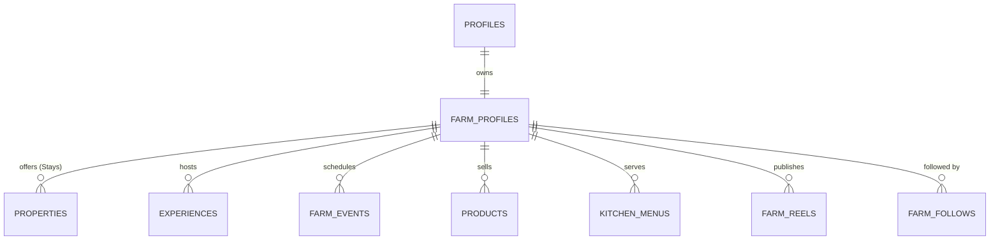

# PRD-002: Unified Farm Profile & Ecosystem Hub

**Feature Title:** Farm Profile & Digital Identity Ecosystem  
**Ecosystem Pillar:** Pillar 1 (The Digital Home)  
**Priority:** P1 (Foundational Anchor of UMANI)  
**Document Status:** Approved Baseline (UMANI v3.0)  
**Owners:** Product Design & Core Frontend  

---

## 1. Executive Summary

### 1.1 Problem Statement
Farmers in traditional agritourism solutions are forced into disconnected tools: a separate hotel listing for cottages, an e-commerce storefront for crops, and disjointed social media accounts. This fragments the farm's brand, makes discovering all offerings difficult for visitors, and deprives farmers of a single digital home.

### 1.2 Proposed Solution
Establish the **Unified Farm Profile**: the single digital anchor answering the foundational question:
> **“What can I discover, experience, and support in this farm?”**

The Farm Profile aggregates the farmer's story, terroir, credentials, and all 6 ecosystem offerings (Reels/Posts, Stays, Experiences, Events & Schedule, Products, and Farm Kitchen menus) under one cohesive, beautiful interface.

### 1.3 Success Criteria
* **Profile Completeness Rate:** $> 75\%$ of verified farm hosts configure at least 3 distinct offering tabs (e.g. Stays + Products + Kitchen).
* **Multi-Offering Discovery:** $\ge 30\%$ of visitors who view a Farm Profile interact with more than one tab during a single session.
* **Direct Audience Growth:** Average verified farm accumulates $> 250$ active followers within 60 days of onboarding.

---

## 2. User Experience & Functionality

### 2.1 User Personas
* **Nanay Tessie (Cacao & Farm Kitchen Host in Davao):** Wants a single profile showcasing her heritage tablea production, her traditional clay-pot cooking dining menu, and her farmstay cottages.
* **Carlos (Weekend Traveler & Food Enthusiast):** Wants to visit a farm profile and immediately understand what crops are growing, what dishes are served at the kitchen, and what workshops are scheduled this weekend.

### 2.2 User Stories
* `As a farmer, I want a structured digital home where my story, location, crops, stays, food, and products live together so that visitors see my farm as an entire living ecosystem.`
* `As a visitor, I want to explore a farm profile through intuitive tabs (Stays, Experiences, Events, Products, Kitchen, Feed) so that I can decide how I want to experience and support the farm.`
* `As an enthusiast, I want to follow a farm and bookmark individual stays or products to return to later.`

### 2.3 Acceptance Criteria
* [ ] **AC-1 (Header & Terroir Summary):** Farm Profile header displays:
  - 16:5 Cover Banner with parallax scrolling (desktop) and full-bleed image (mobile).
  - Farm Avatar, Verified Farmer Badge, Farm Name, and Farmer Full Name/Title.
  - Location badge (Barangay, Municipality, Province, Coordinates) with 1-tap "View on Map".
  - "What We Grow & Produce" category chips (e.g., Heirloom Rice, Mangoes, Bees, Free-Range Poultry).
  - Social stats: Posts count, Followers count, Following count, Total Likes count.
  - Action buttons: `[ Follow / Following ]`, `[ Message Farmer ]`, `[ Share Farm ]`.
* [ ] **AC-2 (Unified 6-Tab Layout):** Profile displays a persistent, sticky sub-navigation bar with 6 tabs:
  1. **Feed:** Video reels grid and photo updates.
  2. **Stays:** Available kubos, cottages, and rooms with night rates and availability triggers.
  3. **Experiences:** Bookable guided tours and hands-on farm activities.
  4. **Events:** Seasonal workshops and harvest calendar events.
  5. **Products:** Direct farm produce, seeds, and processed goods.
  6. **Farm Kitchen:** Seasonal farm-to-table dishes and advance meal pre-orders.
* [ ] **AC-3 (Floating Sticky Action Card on Desktop):** On viewports $\ge 1024\text{px}$, a sticky right-rail widget displays a summary card with quick booking triggers, operating hours, and verified certifications.
* [ ] **AC-4 (Follower Graph & Notifications):** Tapping "Follow" triggers an optimistic state toggle and registers the farm in the user's following list, streaming updates to their home feed.

### 2.4 Non-Goals
* **No Multi-Farm Blending:** A Farm Profile is strictly dedicated to a single farm entity and its verified host; multi-farm co-op directories are rendered separately in the Explore section.

---

## 3. Domain & Data Architecture

---

## 4. Technical Specifications

### 4.1 Integration Points & Schema
* **Primary Table:** `public.farm_profiles` (columns: `id`, `host_id`, `farm_name`, `handle`, `tagline`, `story`, `terroir_notes`, `crops_grown`, `certifications`, `banner_url`, `avatar_url`, `latitude`, `longitude`, `created_at`).
* **Foreign Key Cascade:** Child tables (`properties`, `products`, `farm_events`, `kitchen_menus`) reference `farm_profiles(id)` or `auth.users(id)`.
* **SEO Metadata:** OpenGraph tags generated dynamically for `/@farm_handle` with title, cover banner, description, and Schema.org `LodgingBusiness` + `TouristAttraction` JSON-LD markup.

### 4.2 Security & RLS
* **Public Access:** Public `SELECT` allowed for all active profiles.
* **Mutation Security:** Only the host where `auth.uid() = host_id` can modify profile information.

---

## 5. Risks & Phased Roadmap

### 5.1 Phased Rollout
* **Phase 1 (MVP Baseline):** Profile header, bio, "What We Grow" chips, Stays tab, and Products tab.
* **Phase 2 (Full 6-Tab Integration):** Feed, Experiences, Events & Schedule, and Farm Kitchen tabs.
* **Phase 3 (Terroir & Weather Integration):** Live local microclimate weather widget and soil/terroir data.
