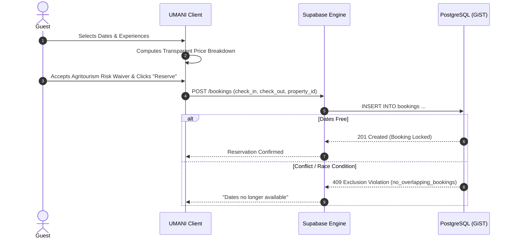

# PRD-003: Farm Stays & Experiences Booking Engine

**Feature Title:** Farm Stays & Experiences Hospitality Engine  
**Ecosystem Pillar:** Pillars 2 & 3 (Hospitality & Hands-On Activities)  
**Priority:** P2 (Core Agritourism Monetization)  
**Document Status:** Approved Baseline (UMANI v3.0)  
**Owners:** Booking Infrastructure & Backend Engineering  

---

## 1. Executive Summary

### 1.1 Problem Statement
Agricultural accommodations (kubos, cottages, glamping) and farm experiences (mango picking, planting runs) operate in outdoor, variable environments. Overbooking causes logistical nightmares for working farms, and travelers often face hidden fees or lack transparent cancellation terms for severe tropical weather.

### 1.2 Proposed Solution
Provide an atomic, reliable **Hospitality & Booking Engine** that supports overnight stays and day experiences with:
1. A zero double-booking concurrency guarantee via PostgreSQL GiST index exclusion constraints.
2. Transparent pricing breakdowns and experience add-ons.
3. Mandatory Agritourism Inherent Hazard Risk acknowledgement during checkout.
4. Automatic PAGASA Tropical Cyclone Signal No. 2+ cancellation and 100% refund protections.

### 1.3 Success Criteria
* **Concurrency Integrity:** Zero double bookings across concurrent reservation attempts under race-condition stress testing ($100\%$ GiST constraint effectiveness).
* **Booking Completion Rate:** $\ge 82\%$ completion rate once dates are selected in the booking drawer.
* **Add-On Conversion:** $\ge 35\%$ of overnight stay reservations include at least 1 farm experience add-on (e.g. coffee harvesting workshop).

---

## 2. User Experience & Functionality

### 2.1 User Personas
* **Kuya Ben (Eco-Lodge Host in Batangas):** Wants to list his 3 bamboo cottages, configure seasonal night rates, block maintenance dates, and offer morning beekeeping tours as add-on packages.
* **Claire (Family Traveler from Quezon City):** Wants to book a 2-night farmstay cottage for 4 guests, select a fruit-picking experience for her children, review transparent pricing, and receive instant booking confirmation.

### 2.2 User Stories
* `As a guest, I want to view a real-time calendar of available dates and pricing per night so that I can choose the best dates for my farm getaway.`
* `As a guest, I want to add day experiences (e.g. tree planting, tour) directly to my stay booking so that my entire itinerary is coordinated in one reservation.`
* `As a host, I want the system to mathematically prevent overlapping bookings so that I never have to awkwardly turn away arriving guests.`

### 2.3 Acceptance Criteria
* [ ] **AC-1 (Zero Double-Booking Guarantee & PHT Anchoring):** Database-level GiST exclusion constraint (`no_overlapping_bookings`) strictly blocks concurrent bookings on conflicting date ranges for statuses `pending` and `confirmed`. All calendar dates, check-in windows (default 2:00 PM PHT), and check-out windows (default 11:00 AM PHT) are anchored in Philippine Standard Time (`Asia/Manila`, UTC+8).
* [ ] **AC-2 (Interactive Availability Calendar):** Multi-month interactive calendar showing blocked dates, active bookings, and dynamic seasonal pricing pills.
* [ ] **AC-3 (Transparent Price Breakdown):** Clear itemized calculation displayed prior to payment:
  $$\text{Total} = (\text{Base Rate} \times \text{Nights}) + \text{Cleaning Fee} + \text{Service Fee} + \sum \text{Experience Add-ons}$$
* [ ] **AC-4 (Mandatory Risk & Emergency Contact Flow):** Checkout modal mandates:
  - Capture of Primary Guest Emergency Contact (Name, Relationship, Philippine Mobile Number).
  - Guest party manifest (guest count and traveling party names).
  - Affirmative checkbox acknowledging the *Agritourism Inherent Hazard Assumption of Risk* (uneven terrain, farm animals, agricultural equipment, tropical weather) and property cancellation tier.
* [ ] **AC-5 (Severe Weather Protocol):** Automated or host-approved 100% refund trigger when PAGASA issues Signal No. 2+ warnings affecting the host municipality.

### 2.4 Non-Goals
* **No Manual Overrides Bypassing GiST:** No administrator or host API endpoint may bypass database exclusion constraints.
* **No Offline Walk-Ins (v3.0):** Offline walk-in booking reconciliation and asynchronous offline reservation queues are explicitly out of scope. Real-time online database connectivity is required to guarantee atomic calendar locking and zero double-booking. Hosts must use the live app to block dates manually.

---

## 3. Booking Concurrency & Pricing Architecture



---

## 4. Technical Specifications

### 4.1 Schema & Constraints
```sql
CREATE EXTENSION IF NOT EXISTS btree_gist;

ALTER TABLE public.bookings
ADD CONSTRAINT no_overlapping_bookings
EXCLUDE USING gist (
    property_id WITH =,
    daterange(check_in, check_out, '[)') WITH &&
)
WHERE (status IN ('pending', 'confirmed'));
```

### 4.2 Security, RLS & Rate Limiting
* **Guest Permissions:** Can create bookings where `auth.uid() = guest_id` and view their own bookings.
* **Host Permissions:** Can view all bookings for properties they own and update status to `confirmed`, `completed`, or `declined`.
* **Zero-Infra Rate Limiting:** Enforced via `check_rate_limit()`: max 5 pending bookings per user per hour to prevent calendar range hoarding. Breaching returns HTTP status 429 with standard `Retry-After` and `RateLimit-*` headers.

---

## 5. Risks & Phased Roadmap

### 5.1 Phased Rollout
* **Phase 1:** Core stay booking with GiST locking, calendar UI, and price calculation.
* **Phase 2:** Experience add-ons integrated into single-flow checkout.
* **Phase 3:** Automated PAGASA weather API integration for automatic force majeure alerts.
