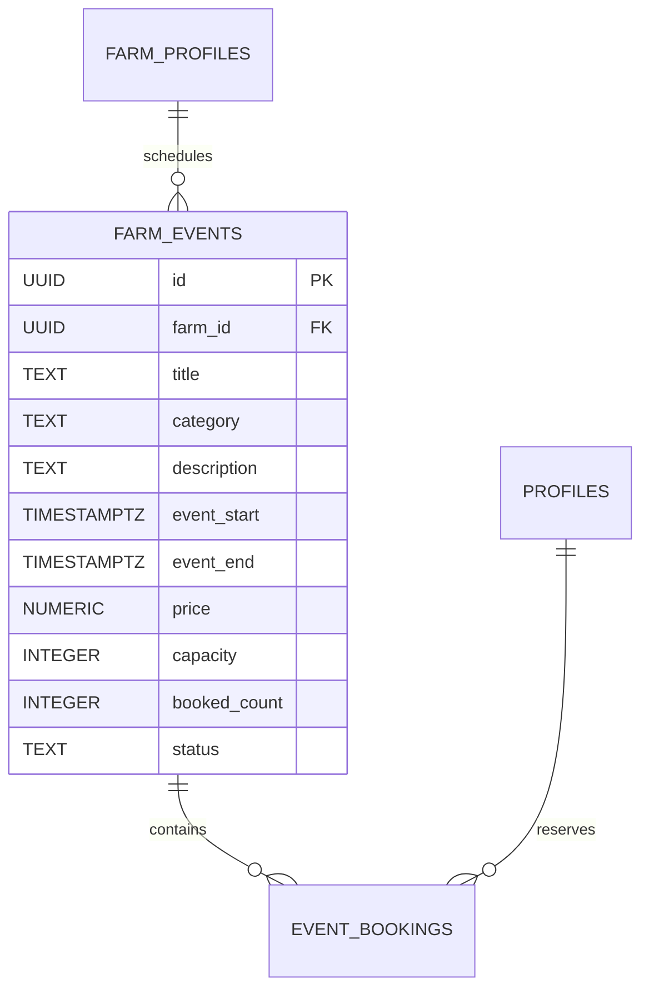

# PRD-004: Events & Seasonal Schedule Engine

**Feature Title:** Seasonal Calendar, Farm Events & Workshop Scheduling  
**Ecosystem Pillar:** Pillar 4 (Events & Schedule)  
**Priority:** P3 (Seasonal Organization & Group Tourism)  
**Document Status:** Approved Baseline (UMANI v3.0)  
**Owners:** Product Design & Full-Stack Engineering  

---

## 1. Executive Summary

### 1.1 Problem Statement
Farms have intense seasonal rhythms (e.g. coffee cherry picking in November–January, strawberry harvests in Benguet from December–March). Without a centralized event and seasonal schedule tool, farms cannot easily organize harvest festivals, cohort workshops, or group planting events, forcing them to coordinate via chaotic direct messages and paper sign-ups.

### 1.2 Proposed Solution
Provide an **Events & Seasonal Schedule Engine** embedded within the Farm Profile and Discovery Feed. Farmers can publish structured events (workshops, festivals, planting days) with capacity limits, scheduled time slots, and ticketing/RSVP tracking, while displaying an intuitive visual harvest calendar of seasonal crop windows.

### 1.3 Success Criteria
* **Event Creation Rate:** $> 40\%$ of verified farms publish at least 1 seasonal event or workshop per quarter.
* **Attendance Reliability:** $< 10\%$ no-show rate through automated email/push calendar reminders.
* **Seasonal Engagement:** $\ge 25\%$ increase in Farm Profile visits during declared peak harvest seasons.

---

## 2. User Experience & Functionality

### 2.1 User Personas
* **Farmer Eric (Beekeeper & Coffee Producer in Benguet):** Wants to schedule a 3-hour "Weekend Honey Harvest Masterclass" for up to 12 participants at ₱850/person with instant RSVP tracking.
* **Anika (University Student & Botanical Hobbyist):** Wants to find upcoming organic farming workshops within 50km for next Saturday and reserve a slot directly on her phone.

### 2.2 User Stories
* `As a farmer, I want to create scheduled events with date, time, capacity limit, and ticket price so that I can manage group tours without overwhelming farm staff.`
* `As a farmer, I want to display our farm's seasonal harvest calendar so visitors know the best months to visit for specific fruits and crops.`
* `As a visitor, I want to RSVP/book an event slot and add it directly to my Google/Apple calendar so that I don't miss the session.`

### 2.3 Acceptance Criteria
* [ ] **AC-1 (Event Creation Interface):** Hosts can create events with Title, Category (Workshop, Harvest Festival, Educational Tour, Farm Dining), Banner Image, Date, Start/End Time, Capacity Limit, and Ticket Fee (or Free).
* [ ] **AC-2 (Capacity Management):** Real-time seat counter prevents over-subscription when capacity is reached, automatically marking the event as `"Sold Out / Full"`.
* [ ] **AC-3 (Visual Harvest Calendar):** Farm Profile displays a seasonal Gantt-style or monthly badge timeline highlighting active and upcoming crop seasons (e.g., *"Carabao Mango: Peak Harvest (Mar - May)"*).
* [ ] **AC-4 (Calendar Integration):** Upon confirmation, attendees receive downloadable `.ics` calendar files and automated in-app/push reminders 24 hours prior to the event.

### 2.4 Non-Goals
* **No Multi-Day Conference Management (v3.0):** Events are scoped to single-day or weekend cohort workshops; multi-day conferences requiring complex breakout rooms are out of scope.

---

## 3. Architecture & Data Model

---

## 4. Technical Specifications

### 4.1 Schema & Security
* **Table:** `public.farm_events` (managed by host RLS) and `public.event_bookings` (managed by attendee RLS).
* **Atomic Capacity Locking:** Managed via transaction function `book_event_ticket(event_id, attendee_id, quantity)` ensuring `booked_count + quantity <= capacity`.

---

## 5. Risks & Phased Roadmap

### 5.1 Phased Rollout
* **Phase 1:** Seasonal Harvest Calendar display on Farm Profiles.
* **Phase 2:** Event creation, capacity tracking, and RSVP booking.
* **Phase 3:** Automated calendar sync (.ics) and real-time weather notice integration.
