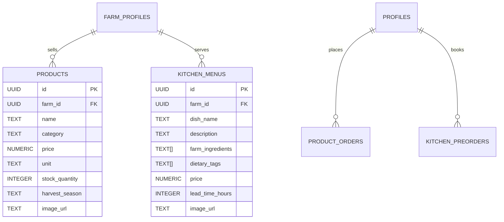

# PRD-005: Products & Farm Kitchen

**Feature Title:** Direct Agricultural Commerce & Farm Kitchen Dining  
**Ecosystem Pillar:** Pillars 5 & 6 (Products & Farm Kitchen)  
**Priority:** P4 (Year-Round Monetization & Culinary Agritourism)  
**Document Status:** Approved Baseline (UMANI v3.0)  
**Owners:** Commerce Infrastructure & Frontend Team  

---

## 1. Executive Summary

### 1.1 Problem Statement
Farmers earn the majority of their income during harvest seasons, leaving significant cash flow gaps throughout the rest of the year. Furthermore, travelers visiting farms frequently seek authentic, farm-to-table culinary experiences and wish to purchase local produce, but lack a way to view menus or pre-order meals made with same-day harvested ingredients.

### 1.2 Proposed Solution
Provide a dual commerce layer within UMANI uniting **Farm Products** (direct agricultural harvests, artisanal processed goods, seedlings, coffee, honey) and **Farm Kitchen** (seasonal farm-to-table food menus, culinary specialties, and advance meal reservations for visitors).

### 1.3 Success Criteria
* **Secondary Revenue Contribution:** Products and Kitchen orders account for $\ge 30\%$ of total gross marketplace volume generated by active farms.
* **Perishable Dispute Resolution:** $< 3\%$ dispute rate on fresh produce through clear 24-hour photographic evidence policy.
* **Meal Pre-Order Adoption:** $> 40\%$ of overnight farmstay guests pre-order at least one Farm Kitchen meal prior to check-in.

---

## 2. User Experience & Functionality

### 2.1 User Personas
* **Manang Lourdes (Coffee & Organic Vegetable Farmer in Cavite):** Wants to sell roasted Robusta beans and heirloom honey online, while listing a weekend "Farm Breakfast Set" (free-range eggs, native sausage, garlic rice, freshly brewed coffee) for visiting tourists.
* **Marco (Food Connoisseur & Home Cook):** Wants to browse local artisanal goods, order 2kg of freshly harvested passion fruit, and reserve a 3-course organic farm lunch ahead of his Sunday day tour.

### 2.2 User Stories
* `As a farmer, I want to list our harvested crops, processed foods, and kitchen menus so that I have multiple income streams beyond lodging.`
* `As a traveler, I want to pre-order lunch from the Farm Kitchen before my trip so the host can prepare fresh ingredients from their morning harvest.`
* `As a consumer, I want clear disclosure of harvest dates and a straightforward 24-hour claim process for damaged perishable goods.`

### 2.3 Acceptance Criteria
* [ ] **AC-1 (Product Catalog Management):** Hosts can create products with Name, Category (Fresh Harvest, Artisanal Goods, Seeds/Seedlings, Pantry), Price, Unit (e.g. per kg, per 500g jar, per bottle), Stock Quantity, and Harvest Season.
* [ ] **AC-2 (Farm Kitchen Menu Management):** Hosts can publish dining items with Dish Name, Description, Farm-Grown Ingredients list, Dietary Badges (Organic, Vegan, Halal, Gluten-Free), Price, and Minimum Advance Notice (e.g., 24 hours notice required).
* [ ] **AC-3 (Advance Meal Booking Integration):** When booking a stay or day experience, guests can opt-in to add specific Farm Kitchen meal items to their reservation.
* [ ] **AC-4 (Perishable Spoilage & Dispute Policy):** Product checkout displays the statutory 24-hour perishable claim policy requiring photo verification for damage or spoilage in transit.
* [ ] **AC-5 (Inquiry & Direct Order Drawer):** Guests can add items to an inquiry cart or initiate a direct order chat with the host.

### 2.4 Non-Goals
* **No Third-Party Multi-Vendor Cart Blending:** Product orders are placed directly with individual farms to preserve direct producer-to-consumer relationships and prevent logistics fragmentation.

---

## 3. Commerce & Kitchen Architecture

---

## 4. Technical Specifications

### 4.1 Schema & Security
* **Tables:** `public.products`, `public.kitchen_menus`, `public.product_orders`, `public.kitchen_preorders`.
* **RLS Policies:** Public read access; mutations restricted strictly to verified profile host (`auth.uid() = host_id`).

### 4.2 Legal & Food Safety Compliance
* **Processed Foods Warranty:** Hosts selling packaged artisanal foods warrant compliance with local sanitary codes and Philippine Food and Drug Administration (FDA) standards.
* **Perishable Dispute Window:** 24-hour photo evidence protocol enforced in order claims table.

---

## 5. Risks & Phased Roadmap

### 5.1 Phased Rollout
* **Phase 1:** Products catalog and Farm Kitchen menu display on Farm Profiles.
* **Phase 2:** Direct product inquiry and chat-based ordering.
* **Phase 3:** Advance meal add-on integration during stay and experience checkout.
