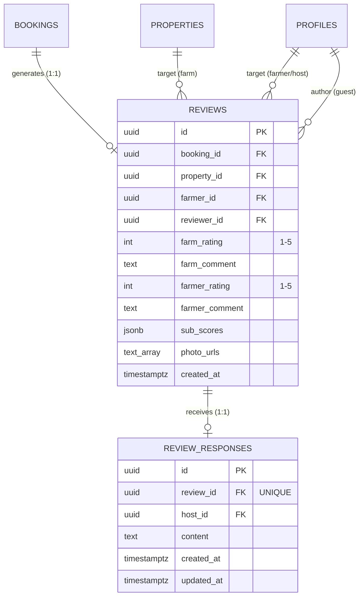

# PRD-007: Whole-Farm & Farmer Dual Reviews Engine

**Feature Title:** Dual Reviews & Farmer Reputation System  
**Ecosystem Pillar:** Trust, Safety & Community (Cross-Pillar Governance)  
**Priority:** P2 (Core Trust & Social Proof)  
**Document Status:** Approved Baseline (UMANI v3.0)  
**Owners:** Community Trust, Frontend Engineering & Database Architecture  

---

## 1. Executive Summary

### 1.1 Problem Statement
In agricultural tourism, travelers evaluate two fundamentally distinct dimensions:
1. **The Farm (The Place):** Accommodations, physical facilities, natural terroir, cleanliness, trail safety, and workshop equipment.
2. **The Farmer (The Person):** Warmth, hospitality, communication, agricultural storytelling, local guidance, and reliability.

Currently, agritourism platforms blur these into a single generic star rating. A guest disappointed by muddy weather or rustic toilet facilities often penalizes the farmer's personal hospitality score, while a charming host can inadvertently mask serious facility or safety deficiencies. Furthermore, farmers currently have no structured mechanism in UMANI to view guest feedback or generate official public responses to build long-term community trust.

### 1.2 Proposed Solution
Implement a **Separated Dual-Review Architecture** within UMANI:
* **Separated Review Submission:** Verified guests independently evaluate (1) the **Farm & Facilities** and (2) the **Farmer / Host Hospitality**.
* **Public Separated Reviews View:** Farm Profiles and listing pages present distinct, toggleable review tabs with category scorecards for both the farm and the farmer.
* **Farmer Host Review Hub & Response Generator:** A dedicated management portal inside `HostDashboard` where farmers can inspect incoming reviews, filter by category/rating, and generate contextual, professional public responses (with templated assistance for quick field replies).

### 1.3 Success Criteria
* **Review Submission Rate:** $\ge 42\%$ of completed stay and experience reservations submit a verified review within 14 days of checkout.
* **Separated Attribution Accuracy:** $100\%$ of submitted reviews provide distinct ratings for Farm and Farmer.
* **Host Engagement:** $\ge 65\%$ of verified farm hosts post a public response to guest reviews within 7 days of submission.
* **Trust & Conversion Lift:** Farms with $\ge 5$ verified reviews and active host responses experience $\ge 28\%$ higher inquiry-to-booking conversion.

---

## 2. User Experience & Functionality

### 2.1 User Personas
* **Kuya Ben (Batangas Honey & Mango Host):** Wants to read what guests liked about his weekend beekeeping tours, respond graciously to first-time visitors, and address feedback regarding dirt road signage without hurting his 4.9 personal host reputation.
* **Analyn (Family Traveler from Manila):** Wants to rate the charming mango cottage and clean swimming pond separately from Kuya Ben's exceptional personal guidance, and read the farmer's replies to past guests before booking.
* **Maria (Trust & Safety Moderator):** Wants clear moderation audit trails to review flagged comments, resolve disputes, and ensure reviews adhere to the Philippine Agritourism Hazard framework.

### 2.2 User Stories
* `As a verified guest, I want to review both the physical farm and the farmer separately so that my feedback accurately reflects both the facilities and the human hospitality.`
* `As a traveler browsing a Farm Profile, I want to toggle between "Farm Reviews" and "Farmer Reviews" so that I can evaluate amenities and host warmth independently.`
* `As a farmer, I want a dedicated dashboard to see all incoming reviews across my stays and experiences so that I can understand guest feedback in real time.`
* `As a farmer, I want to write and publish an official host response beneath any guest review so that future travelers see our commitment to care and transparency.`
* `As a farmer working in the field, I want one-tap response templates so that I can reply promptly from my phone without typing lengthy essays.`

### 2.3 Acceptance Criteria

#### AC-1: Verified Transaction Gating & Anti-Fraud
* Reviews are strictly gated to **verified transactions** (`bookings.status = 'completed'`).
* Unauthenticated visitors or guests with pending/cancelled bookings cannot submit reviews.
* One review submission allowed per completed booking ID (enforced via database unique constraint).
* Review window opens at checkout (`11:00 AM PHT` on `check_out` date) and remains active for **30 calendar days**.

#### AC-2: Dual-Entity Review Submission Flow
* The review modal presents two distinct, required evaluation steps:
  1. **Section 1: The Farm & Facilities (`farm_rating`, 1–5 stars):**
     * Sub-criteria: Cleanliness & Comfort, Natural Environment & Grounds, Safety & Rule Clarity.
     * Farm comment textarea (up to 600 characters).
     * Optional photo upload (up to 3 photos of the cottage or farm).
  2. **Section 2: The Farmer & Host Hospitality (`farmer_rating`, 1–5 stars):**
     * Sub-criteria: Hospitality & Care, Communication & Responsiveness, Farm Storytelling & Guidance.
     * Farmer personal tribute/comment textarea (up to 600 characters).

#### AC-3: Public Separated Reviews Presentation
* On both the **Farm Profile** (`/farms/:id`) and **Property Details** (`/properties/:id`), the Reviews section includes a persistent segmented switch:
  * `[ 🏡 The Farm & Grounds (4.8 ★) ]` | `[ 👨‍🌾 Kuya Ben - Host Hospitality (5.0 ★) ]`
* **Farm Reviews Tab:** Displays facility photos, stay dates, sub-scores (Cleanliness, Grounds, Safety), and property tags.
* **Farmer Reviews Tab:** Displays personal guest tributes, host badges ("Storyteller", "Superhost", "Master Beekeeper"), and communication ratings.
* Each review displays the verified booking badge: `✓ Verified Stay (2 nights • Bamboo Cottage)`.

#### AC-4: Farmer Review Management Hub (`HostDashboard`)
* A new top-level tab in `HostDashboard`: **"Reviews"** (`/host?tab=reviews`).
* **Summary Scorecards:**
  * Farm Overall Rating vs. Farmer Hospitality Rating.
  * Total Reviews received, 5-star percentage breakdown.
  * "Needs Reply" count badge.
* **Filter Controls:**
  * View: `All`, `Needs Response`, `Farm Reviews`, `Farmer Reviews`.
  * Rating Filter: `5 Stars`, `4 Stars`, `3 Stars & Below`.
  * Search by guest name or booking code.

#### AC-5: Farmer Public Response Generator
* For any guest review, the host can click **"Write Response"**:
  * Response input modal with live preview.
  * **Farmer Field Response Presets (1-Tap Templates):**
    * *Preset A (Gratitude & Welcome Back):* "Thank you so much, [Guest Name]! It was a joy hosting you and your family. We hope to welcome you back next harvest season!"
    * *Preset B (Seasonal / Terroir Context):* "Thank you for the kind words! Farm conditions change with the rainy season, and we're currently upgrading the stone footpaths for an even better stay."
    * *Preset C (Constructive Action Taken):* "Thank you for the valuable feedback regarding [Topic]. We have already addressed this with our farm team to ensure seamless visits."
* Only **one public host response** is permitted per review.
* The response is nested directly beneath the guest's review with an official `"Response from Kuya Ben (Host)"` green badge and timestamp.

### 2.4 Non-Goals
* **No Anonymous Reviews:** All reviews must display the verified guest profile name and avatar. Anonymous slander or unsanctioned reviews are strictly blocked.
* **No Direct Host Editing of Guest Content:** Farmers cannot delete or edit guest comments; disputing a fraudulent review requires flagging to Platform Moderators (`moderator` role).
* **No Retaliatory Negative Reviews:** Two-way guest review disclosure occurs simultaneously (double-blind), or host feedback on guests remains internal to host trust metrics.

---

## 3. Domain & Data Architecture



### 3.1 Schema Definition

```sql
-- Extension of reviews table to support dual-entity evaluation
ALTER TABLE public.reviews
ADD COLUMN IF NOT EXISTS farmer_id UUID REFERENCES public.profiles(id) ON DELETE CASCADE,
ADD COLUMN IF NOT EXISTS farm_rating INTEGER CHECK (farm_rating BETWEEN 1 AND 5),
ADD COLUMN IF NOT EXISTS farm_comment TEXT,
ADD COLUMN IF NOT EXISTS farmer_rating INTEGER CHECK (farmer_rating BETWEEN 1 AND 5),
ADD COLUMN IF NOT EXISTS farmer_comment TEXT,
ADD COLUMN IF NOT EXISTS sub_scores JSONB DEFAULT '{}'::jsonb,
ADD COLUMN IF NOT EXISTS photo_urls TEXT[] DEFAULT ARRAY[]::TEXT[];

-- Table for official public farmer replies
CREATE TABLE IF NOT EXISTS public.review_responses (
  id UUID PRIMARY KEY DEFAULT gen_random_uuid(),
  review_id UUID NOT NULL UNIQUE REFERENCES public.reviews(id) ON DELETE CASCADE,
  host_id UUID NOT NULL REFERENCES public.profiles(id) ON DELETE CASCADE,
  content TEXT NOT NULL CHECK (char_length(trim(content)) > 0 AND char_length(content) <= 800),
  created_at TIMESTAMPTZ NOT NULL DEFAULT now(),
  updated_at TIMESTAMPTZ NOT NULL DEFAULT now()
);

-- Performance Indexes
CREATE INDEX IF NOT EXISTS idx_reviews_farmer_id ON public.reviews(farmer_id);
CREATE INDEX IF NOT EXISTS idx_reviews_property_id ON public.reviews(property_id);
CREATE INDEX IF NOT EXISTS idx_review_responses_review_id ON public.review_responses(review_id);
```

### 3.2 Aggregation Database Views

```sql
-- Farm Ratings View
CREATE OR REPLACE VIEW public.farm_ratings AS
SELECT
  property_id,
  ROUND(AVG(COALESCE(farm_rating, rating))::numeric, 1) AS average_farm_rating,
  COUNT(id) AS farm_review_count
FROM public.reviews
GROUP BY property_id;

-- Farmer Host Hospitality Ratings View
CREATE OR REPLACE VIEW public.farmer_hospitality_ratings AS
SELECT
  farmer_id,
  ROUND(AVG(COALESCE(farmer_rating, rating))::numeric, 1) AS average_hospitality_rating,
  COUNT(id) AS hospitality_review_count
FROM public.reviews
WHERE farmer_id IS NOT NULL
GROUP BY farmer_id;
```

---

## 4. Security, RLS & Moderation

### 4.1 Supabase RLS Policies
```sql
ALTER TABLE public.review_responses ENABLE ROW LEVEL SECURITY;

-- Anyone can read public host replies
CREATE POLICY "Host responses are viewable by everyone"
  ON public.review_responses FOR SELECT
  USING (true);

-- Only the verified host of the property/farmer_id can reply
CREATE POLICY "Hosts can create replies to reviews on their listings"
  ON public.review_responses FOR INSERT
  WITH CHECK (
    auth.uid() = host_id AND
    EXISTS (
      SELECT 1 FROM public.reviews r
      WHERE r.id = review_responses.review_id
      AND (r.farmer_id = auth.uid() OR EXISTS (
        SELECT 1 FROM public.properties p
        WHERE p.id = r.property_id AND p.host_id = auth.uid()
      ))
    )
  );
```

### 4.2 Content Moderation & Abuse Prevention
* **Profanity & Hate-Speech Scanning:** Client-side and server-side text regex checks block abusive slurs.
* **Flag as Inappropriate:** Any authenticated user or host can click `[ ⚑ Report Review ]` on a review or response, dispatching a high-priority ticket to the `moderator` queue with the reason (e.g. *Defamation, Inaccurate Claim, Harassment*).
* **Statutory Compliance:** Aligned with Philippine Data Privacy Act (RA 10173) and Consumer Act protections. Personal phone numbers or financial details in review text are automatically redacted.

---

## 5. Implementation Roadmap

* **Phase 1 (Database & API Layer):**
  * Migration for dual-rating fields on `reviews` and creation of `review_responses` table with RLS policies.
  * Supabase views `farm_ratings` and `farmer_hospitality_ratings`.
* **Phase 2 (Guest Review Submission UI):**
  * Dual-step `SubmitReviewForm` modal with animated star selectors and sub-scores.
  * Integration on `Bookings.tsx` and `PropertyDetails.tsx`.
* **Phase 3 (Public Separated Presentation):**
  * Segmented `ReviewsSection` on Farm Profile and Property Details (`Farm Reviews` vs `Farmer Reviews`).
  * Nested official host replies display card.
* **Phase 4 (Farmer Response Hub):**
  * "Reviews" tab in `HostDashboard.tsx`.
  * One-tap response composer with field presets and notification dispatch to reviewer.
