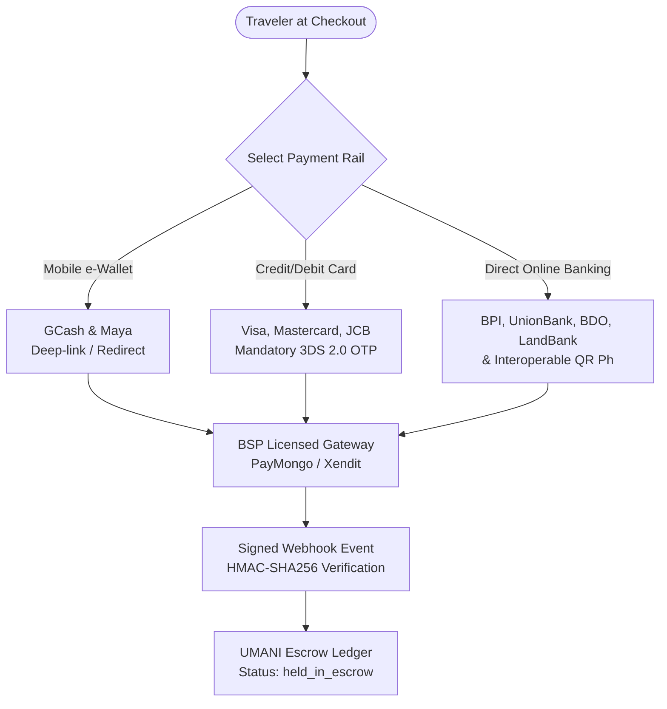
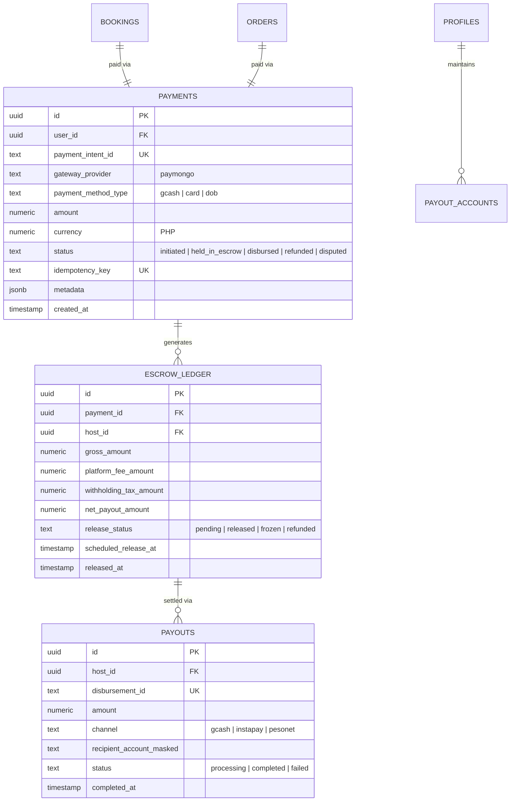

# SPEC-003: Payment Gateway, Marketplace Escrow & Host Disbursements Architecture

> **MANDATORY ENGINEERING & PAYMENT SPECIFICATION:**  
> All payment flows, mobile checkout sheets, webhooks, escrow state machines, host disbursements, and tax deductions across UMANI (Web and native Capacitor iOS/Android) MUST strictly conform to the standards documented here.

---

## 1. Executive Summary & Regulatory Classification

UMANI operates as an **Electronic Marketplace Operator** connecting travelers/consumers with independent agricultural producers and farmstead hosts.

* **Primary Payment Aggregator:** Licensed Bangko Sentral ng Pilipinas (BSP) Operator of Payment Systems (OPS) — **PayMongo** (with enterprise fallback to **Xendit Philippines**).
* **Cardholder Security Scope:** Strict **PCI DSS SAQ A** compliance. Zero cardholder data (PAN, CVV, PIN, magnetic stripe) touches UMANI servers or Supabase databases.
* **Tax Governance:** Compliant with **BIR Revenue Regulation No. 16-2023** (1% withholding on 50% gross remittance for electronic marketplaces) and the **Ease of Paying Taxes (EOPT) Act (RA 11976)** (5-year immutable ledger retention).

---

## 2. The Tri-Rail Payment System

UMANI supports three localized payment rails aggregated through a single API abstraction:



### 2.1 Rail 1: Mobile e-Wallets (GCash & Maya)
* **Market Share:** Dominant consumer payment rail in the Philippines (>80% penetration).
* **Implementation:** PayMongo `payment_method_types: ["gcash", "paymaya"]`.
* **Mobile Flow:** Native URL scheme interception (`gcash://`) inside Capacitor WebViews to seamlessly launch the native GCash application, returning via deep-link: `umani://checkout/callback?session_id={id}&status=success`.

### 2.2 Rail 2: Credit & Debit Cards (Visa, Mastercard, JCB)
* **Security:** Mandatory **3D Secure 2.0 (3DS)** authentication. Cards without 3DS or failing OTP verification are automatically declined to prevent stolen card testing and protect hosts from chargebacks.
* **Tokenization:** Card details are entered exclusively into PayMongo Secure Elements. Only ephemeral payment intent IDs and sanitized masked metadata (`brand: 'visa'`, `last4: '4242'`) are persisted.

### 2.3 Rail 3: Direct Online Banking & QR Ph
* **Direct Online Banking (DOB):** Direct API rails for major Philippine commercial banks: **BPI, UnionBank of the Philippines, BDO Unibank, Metrobank, and LandBank**.
* **QR Ph (National Standard):** Generates a dynamic, one-time payment QR code conforming to the Philippine National QR Standard (QR Ph). Travelers scan directly using their personal banking or wallet app.

---

## 3. Seven Architectural Best Practices Enforced

### 3.1 Idempotency Keys (Duplicate Charge Elimination)
* Every checkout initiation and payment capture API call transmits a unique `Idempotency-Key` header (UUIDv4 tied to the reservation or order ID).
* If a mobile user experiences a network timeout or repeatedly taps **"Pay with GCash"**, the gateway recognizes the idempotency key and returns the existing transaction response instead of creating a second charge.

### 3.2 Dual Webhook & Polling Reconciliation (The Hybrid Model)
* **Single Source of Truth:** Event-driven signed webhooks (`payment.paid`) are the primary source of truth.
* **The "Closed Window" Edge Case:** If a traveler completes authorization inside the GCash app but closes their browser before redirecting back to UMANI, the webhook automatically transitions the booking to confirmed.
* **Client-Side Fallback:** When the traveler returns to the app, a lightweight fallback status endpoint (`/api/checkout/verify?session_id=...`) performs an immediate reconciliation check against PayMongo.

### 3.3 Cryptographic Webhook Verification & Replay Defense
* **Signature Verification:** Every incoming webhook payload must be validated against the gateway's webhook secret using **HMAC-SHA256**. Unsigned or invalid requests return `HTTP 401 Unauthorized`.
* **Replay Attack Window:** Webhook timestamps are validated; payloads older than **5 minutes (300 seconds)** are rejected immediately.
* **Immediate Acknowledgment:** The webhook endpoint returns `HTTP 200 OK` within 500ms and delegates ledger processing to an asynchronous worker to prevent gateway timeout retries.

### 3.4 Concurrency Protection & Calendar Locking (Postgres GiST)
* When a guest enters the checkout sheet for a Farm Stay, a **temporary 15-minute checkout lock** is placed on the property calendar.
* This prevents calendar race conditions before the PostgreSQL GiST exclusion constraint (`no_overlapping_bookings`) is locked permanently upon successful payment confirmation.

### 3.5 The Two-Stage Escrow Lifecycle
To eliminate fraud, UMANI holds funds in platform escrow until fulfillment is verified:

| Offering Type | Escrow Release Trigger | Dispute Window |
| :--- | :--- | :--- |
| **Farm Stays & Accommodations** | Exactly **24 hours post-check-in** | Within 24h of check-in (Host no-show or uninhabitable conditions) |
| **Farm Experiences & Tours** | Exactly **24 hours post-session** | Within 24h of tour start time |
| **Direct Harvest Produce** | Exactly **24 hours post-courier delivery** | Within 24h of delivery with photographic proof (RA 7394 spoilage) |
| **Farm Kitchen Pre-orders** | Settled alongside the accompanying stay | Immediate on-site dining report |

### 3.6 Automated Host Disbursements
* **Platform Commission:** Automatically deducted prior to remittance:
  * **15%** on Farm Stays and Experiences.
  * **10%** on Direct Harvest Produce.
* **Disbursement Rails:**
  * **InstaPay:** Real-time instant remittance (amounts $\le ₱50,000$) directly to the farmer's verified **GCash wallet** or **Philippine bank account**.
  * **PESONet:** Same-day batch clearing for larger amounts ($> ₱50,000$).

### 3.7 PAGASA Severe Weather Force Majeure Engine
* Automated cancellation pipeline connected to PAGASA tropical cyclone signals:
* When **Tropical Cyclone Wind Signal No. 2 or higher** is raised over the farm's municipality or the guest's origin, the booking qualifies for an automated **100% penalty-free refund** without cancellation deductions.

---

## 4. Database Schema Architecture



---

## 5. Mobile Deep-Link & Capacitor Handler Implementation

In the native Capacitor mobile environment (`/ios` and `/android`), checkout redirects are intercepted cleanly:

```typescript
// core/platform/payments.ts
import { App } from '@capacitor/app';
import { Browser } from '@capacitor/browser';

export async function openPaymentSheet(checkoutUrl: string, returnUrl: string) {
  // Listen for native deep link return
  const listener = await App.addListener('appUrlOpen', async (data) => {
    if (data.url.startsWith('umani://checkout/callback')) {
      await Browser.close();
      await listener.remove();
      // Handle completion & trigger verification endpoint
    }
  });

  // Open secure custom in-app browser tab (preserves cookie/session security)
  await Browser.open({ url: checkoutUrl, windowName: '_blank' });
}
```

---

## 6. Regulatory Compliance & 5-Year Audit Ledger

1. **BIR Revenue Regulation No. 16-2023:**  
   UMANI acts as an electronic marketplace withholding agent, deducting 1% withholding tax on 50% of gross remittances where required by law, unless the farmer has submitted an annual BIR sworn declaration of gross remittances below ₱500,000.
2. **Ease of Paying Taxes (EOPT) Act (RA 11976):**  
   Every transaction row in `public.payments`, `public.escrow_ledger`, and `public.payouts` is immutable. Account deletion under privacy laws scrubs personal identifiers (`user_id = NULL`, customer name masked to `'Deleted Guest'`), but preserves financial accounting totals for the statutory **5-year retention period**.
